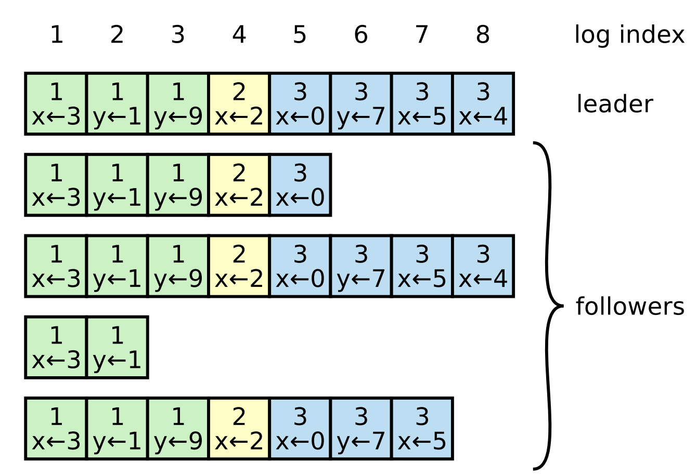
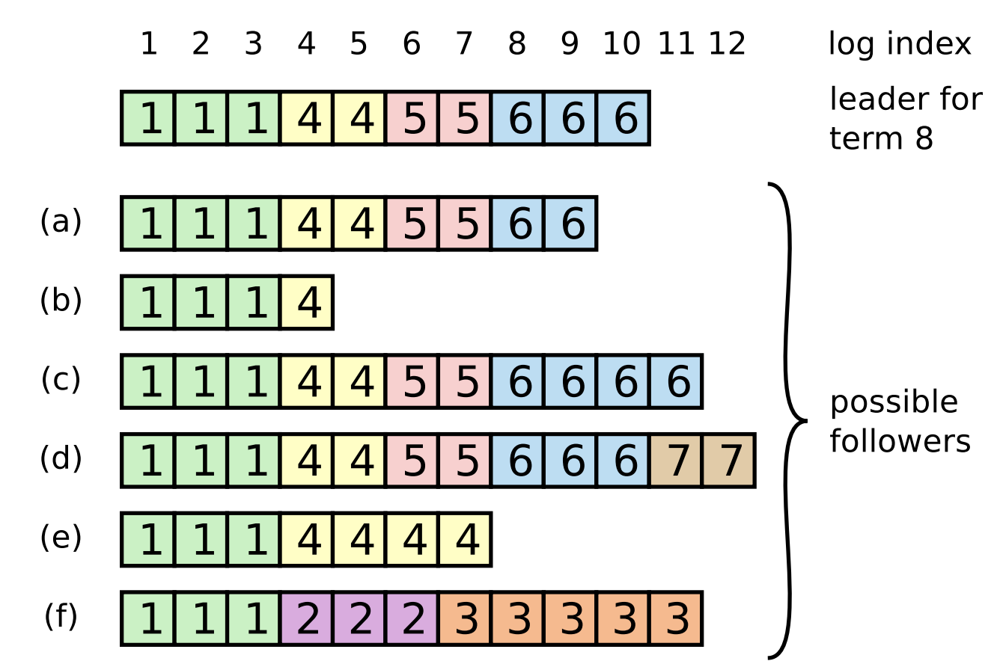
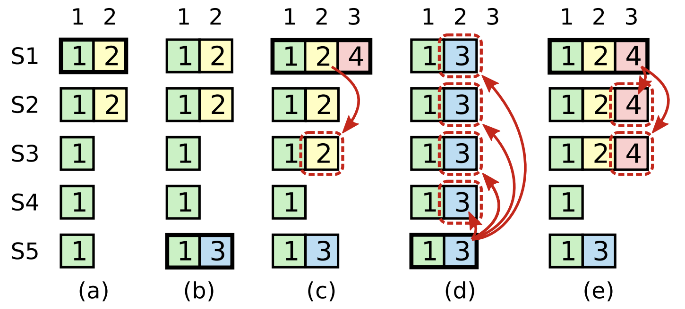

## 前言
我计划写raft的一系列文章，包含从理论到代码实践，此文章依托于MIT的研究生课程。 

## 背景
raft 是一种分布式的共识算法，其目的是要实现多个节点集群的容错性,一致性从而能够构建大规模的软件系统。 
在raft之前，比较有名的是Paxos。但是paxos难于理解。 
raft的诞生是为了让共识算法更容易理解,在工程上更容易实现。 

和其他的共识算法不同的是，raft具有下面的特点： 
1、leader：raft中会有一个领导者具有超级权限，可以把自己的log 复制到其他节点中。 
2、leader election： raft每隔一段随机的时间就会进行leader的选举 
3、raft允许集群配置变化时正常运行。 

## Replicated state machine
状态机是分布式系统中的一个重要概念，任何一个系统的最终状态都可以看成是每一个操作的集合。因此，算法会维护一份replicated log，将每一份操作都存储起来。 
每一个节点只要按顺序执行log中的命令，就会到达相同的最终状态。这样，即便是系统奔溃也可以快速的恢复。 
共识算法需要保证relicated log的一致性,服务器收到客户端发出来的执行命令Command后，会将其加入到log中。 
服务器之间会相互的交流，保证最后的log的一致性（即便服务器奔溃），即Command 会复制到其他服务器的log中，所有服务器的log是相同的，有序的。 
其他服务器会执行此log，即会执行此命令。最后，所有的服务器都会到达同一个状态。 

共识算法必须满足下面的属性：
1、在极端情况下（丢包、奔溃）任然能够保证安全性。 
2、大多数节点正常的情况下能够保证可用。 
3、不能依靠时间戳去保证log的一致性。 
4、当大部分的节点通过RPC远程调用交流 达成共识后，command就可以被确认和执行。小部分节点的不稳定不会影响整个系统。 

## raft basic
raft集群一般保持奇数个数量（5个节点比较普遍). 从而只要大部分节点存活，即可用。 
raft中的节点有3种状态。 leader, Candidates, follower。 
1、一般的状态只会存在一个leader，其余的节点都是follower。 
2、leader会处理所有的客户端请求， 如果是客户端请求follower，也会被转发到leader处理。 
3、Candidates 是一种选举时候的过渡状态，用于自身拉票选举leader。 

在raft中会有一个叫做term的时间周期。term是以选举leader开始的，如果Candidates选举成为了leader，那么其会成为这个term剩下时间的leader。 
有时候，在整个term周期都没有选举出leader。这时一个新的选举会在不久后开始。 
Terms 在raft中类似于一种时间戳，后一个一定比前一个后发生，这一点和比特币中的区块链很类似。 
每一个服务器会存储一个当前的term，其会随着时间的增加而增长。如果某一个节点的当前term小于其他节点，那么节点会更新自己的term为最大的term。 
如果一个candidate 发现自己当前的term 过时了，那么其会立即变为follower。 
raft节点之间通过RPC（远程过程调用）来进行通信。 RequestVote 方法用于candidate在选举时候使用，AppendEntries用于leader在通知其他节点复制log时使用。同时也用于心跳检测。 
RPC 是并发的，并支持失败重试。 

## 选举
在raft中会有一套心跳检测，只要follower收到来自leader或者Candidates的数据，那么其会保持follower的状态。 
如果follower一段时间内没有收到RPC请求，这意味着选举超时（ election timeout ）。 
这时follower会将current term 加1，过渡到Candidates状态。 
其会给自己投票，并发送RequestVote RPC请求给其他的节点，拉票！ 

Candidates状态会持续，直到下面的3种情况发生:
1、当其获得了大部分节点的支持后，其赢得了选举，变为了leader。 
一旦其变为了leader，其会向其他节点发送 AppendEntries RPC， 确认其leader的地位，阻止选举。 
2、其他节点成为了leader。 
如果其收到了其他节点的AppendEntries RPC. 并发现其他节点的current term比自己的大,则其变为follower状态。 
3、一段时间过去任然没有参与者。 
如果有许多的节点同时变为了candidate,则可能会出现一段时间内都没有节点能够选举成功的情况。 
在raft中，为了快速解决并修复这个问题，规定了每一个candidate在选举前会重置一个随机的选举超时（ election timeout ）时间，此随机时间会在一个区间内（eg.150-300ms） 
这样保证了，在大部分的情况下，有一个唯一的节点首先选举超时，其在大部分节点选举超时前发送心跳检测，赢得了选举。 

当一个leader在心跳检测中发现另一个节点有更高的term时，会转变为follower。否则其将一直保持leader状态。 
## 日志复制(Log replication)
当成为leader后，其会接受来自客户端的请求。每一个客户端请求都包含一个将要被节点的状态机执行的command。 
leader其会将这个command 包装为一个entry放入到log中，并通过AppendEntries RPC 发送给其他节点，要求其添加此entry到log中。 

当entry被 大部分的节点接受并复制后，这个entry的状态变为了committed.  raft算法保证了commited entry到最后一定能够会被所有节点的状态机执行。 
一旦follower知道（AppendEntries RPC）某一个entry被commit之后，follower会按顺序执行log中的entry 

如图所示，我们可以把log 理解为entry的集合。在entry中包含了common命令、entry所在的term 以及每一个entry的顺序编号index。 

raft的一致性保证了下面的属性： 
1、如果在不同节点中log中的entry有相同的index 和term。 那么一定存储的是相同的command。 
2、如果在不同节点中log中的entry有相同的index 和term。 那么此entry之前的所有entry都是相同的。 

节点f可能会发生，如果其是term 2的leader, 添加entry到log中，但是没有commit时就奔溃了，其快速恢复后又变为了term 3 的leader， 添加entry到log中，没有commit又继续奔溃了。 

在正常的情况下，上面的两个属性都能满足，但是异常情况下，这种情况会被打破，可能会出现如上图所示的情形， 

在raft中，为了处理这样的不一致性，强制要求follower的log与leader的log要一致。 

因此leader必须要发现一个entry，在这个entry之后的都是不相同的entry。在这个entry之前的都是一致的entry。在leader中会为每一个follower维护一份nextIndex 数组。标志了将要发送给follower的下一个index。 最后，follower会删除掉所有不同的entry，并用和leader一致的log。这一过程，都会通过AppendEntries RPC 执行完毕。当AppendEntries RPC返回success，就表明follower 与 leader的log是一致的。 

## 安全性
上面的属性还不能够充分的保证系统的安全性。 考虑下面的例子： 

上图要说明的是，一个已经被commit的entry 在目前的情况下是有可能被覆盖掉的。例如在a 
阶段s1成为了leader，其entry还没有commit。 在b阶段,s1奔溃，s5成为了leader ，添加log但是任然没有commit。 在c阶段，s5奔溃，s1成为了leader。其entry成为了commit。 在d阶段s1奔溃，s5成为了leader，其会将本已commit的entry给覆盖掉。 

raft使用一种更简单的方式来解决这个难题，raft为leader添加了限制: 
 要成为leader 必须要包含过去所有的commit entry。 
 Candidates 要想成为leader，必须要经过大部分follower节点的同意。 
 而commit entry 也表明其已经存在于大部分的服务器中。 因此commit entry 至少会出现在这些follower节点中的至少有一个节点。因此我们可以证明，在大部分的follower中，至少有一个是包含了leader的所有commit entry的。 
 因此 如果一个candidate的log是最新的（即他与其他的节点对比时，如果term更大的，最新。如果term相同的，那么越长的那个log越新。）其才可以成为leader。 

 因此可知，一个leader一定包含了以前leader的commit entry。 

## todo
配置改变、 日志压缩快照（log compaction / snapshotting ） 

## 总结
上面对于raft的描述，保证了存在5点： 
1、Election Safety：在一个term周期内只会存在一个leader。 
2、Leader Append-Only： leader只会添加log，而不会删除或者覆盖log。 
3、Log Matching：如果两个log有一个相同index与term的entry，那么他们之前的log都是相同的。 
4、Leader Completeness：如果一个log entry在一个term周期成为commit， 那么其一定会存在于下一个leader的log中。 
5、State Machine Safety：如果某节点已经将index A 应用于其状态机。则以后其他节点不可能在同一index A 却具有不同的log entry。 因为应用到状态机说明已经被commit，而借助于第4点得证。 

## 参考资料
* [my blog](https://dreamerjonson.com/2019/12/29/golang-110-lab-raft/)
* [raft论文](http://nil.csail.mit.edu/6.824/2017/papers/raft-extended.pdf)
* [raft可视化](http://thesecretlivesofdata.com/raft/)
* [知乎，写得一般但是有借鉴地方](https://zhuanlan.zhihu.com/p/32052223)

## 技术交流群
    * QQ群：713385260