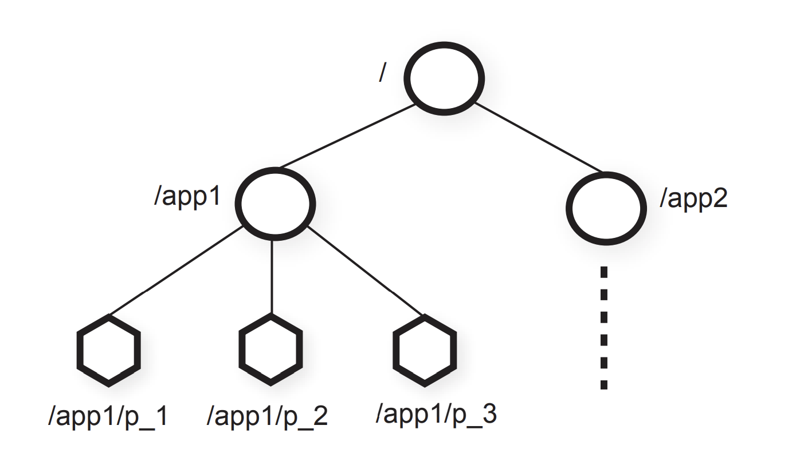

# 6.824分布式系统[4]-Zookeeper在主从复制的应用

## 准备工作
*  阅读论文[ZooKeeper: wait-free coordination for internet-scale systems](https://pdos.csail.mit.edu/6.824/papers/zookeeper.pdf)
*  阅读[raft理论与实践[6]-lab3a-基于raft构建分布式容错kv服务](https://zhuanlan.zhihu.com/p/107074773)

## 为什么要阅读这篇文章
* Zookeeper是广泛使用的主从复制状态机服务
  + 受Chubby（Google的全局锁定服务）启发
  + 最初在Yahoo得到应用，后来在Mesos, HBase广泛使用
* Apache 开源项目
  + [项目链接](http://zookeeper.apache.org/)
* 主从复制的案例研究
* API支持广泛的用例
* 性能优越

## 发展Zookeeper的动机
* 服务集群中的许多应用程序需要协调通信
  + 例如对于GFS服务需要master存储每一个块服务器的列表，master决定哪一个块是primary等。
* 应用程序之间需要相互发现
  + MapReduce架构中需要了解GFS master的ip和port
* 性能优越
  + 以lab3中3个节点的raft算法作对比，需要执行2次磁盘写入和一次消息往返，对于磁盘，大约50 msg/sec。对于ssd，大约200 msg/sec
  + 但是Zookeeper能处理大约21,000 msg/sec,源于client允许异步调用机制，以及pipelining消息处理。

## Zookeeper的替代方案：为每一个应用程序开发容错的master服务
* 根据DNS标识ip与端口
* 处理容错
* 高性能

## Zookeeper设计: 通用的协调服务
* 设计挑战
  + API的设计
  + 如何使master容错
  + 如何获得良好的表现
* 基本设计
  + 主从状态机
  + 主从复制的是znodes对象
  + znode是客户端通过ZooKeeper API处理的数据对象，znodes以路径命名，其通过分层的[名称空间](https://en.wikipedia.org/wiki/Namespace)组织，类似于unix的文件系统



  + 分层的名称空间是组织数据对象的一种理想方式，因为用户已经习惯了这种抽象，并且可以更好地组织应用程序元数据。
  + znodes包含应用程序的元数据（配置信息、时间戳、版本号）
  + znodes的类型：Regular(客户端通过显式创建和删除常规znode来操作它们)，empheral(客户端创建了此类znode，它们要么显式删除它们，要么让系统在创建它们的会话终止时（故意或由于失败）自动将其删除)
  + 为了引用给定的znode，我们使用标准的UNIX符号表示文件系统路径。 例如，我们使用/A/B/C表示 znode C的路径，其中C的父节点为B，B的父节点为A，除empheral节点外，所有节点都可以有子节点
  + znode命名规则: name + 序列号。  如果n是新的znode，p是父znode，则n的序列值永远不会小于在p下创建的任何其他znode名称中的序列值
  + ZooKeeper的数据模型本质上是一个具有简单API且只能读取和写入完整数据的文件系统，或者是具有层次结构键的键/值表。 层次名称空间对于为不同应用程序的名称空间分配子树以及设置对这些子树的访问权限很有用。
* 会话(session)
  + 客户端连接上zookeeper时会初始化会话
  + 会话允许在故障发生时，客户端请求转移到另一个服务（client知道最后完成操作的术语和索引）
  + 会话有时间限制，client必须持续刷新会话（通过心跳检测）

* znodes上的操作
  + create(path, data, flags)
  + delete(path, version) if znode.version = version, then delete
  + exists(path, watch)
  + getData(path, watch)
  + setData(path, data, version) if znode.version = version, then update
  + getChildren(path, watch)
  + sync() 除此操作的其他操作是异步的，每个client的所有操作均按FIFO顺序排序。同步会一直等到之前的所有操作都认可为止
* 顺序保证
  + 所有写操作都是完全有序的
  + ZooKeeper会对所有client发起的写操作做全局统一排序
  + 每一个client的操作都是FIFO顺序的。
  + read操作能够感知到相同客户端的其他写操作
  + read操作能够感知之前的写操作针对相同的znode

## ready znode与配置改变
* ZooKeeper中，新的leader可以将某个path指定为ready znode。 其他节点将仅在该znode存在时使用配置。
* 当leader 重建配置之后，会通知其他副本重建配置，并新建ready znode.
* 副本为了防止出现不一致，必须在重建配置时，处理完其之前的所有事务。保证所有服务的状态一致。
* 任何一个副本更新失败，都不能够应用都需要进行重试。

## Zookeeper使用lock的例子
* 下面的伪代码向我们锁的实现。通过create试图持有锁，如果锁已经被其他的client持有，则通过watch方式监控锁的释放。
```
acquire lock:
   retry:
     r = create("app/lock", "", empheral)
     if r:
       return
     else:
       getData("app/lock", watch=True)

    watch_event:
       goto retry

  release lock:
    delete("app/lock")
```

* 由于上面的伪代码可能会出现羊群效应，可以尝试下面的方式
* znode下方的children中，序号最低的的是持有锁的
* 其他在等待的client只watch前一个znode的变化，避免了羊群效应

```
  acquire lock:
     n = create("app/lock/request-", "", empheral|sequential)
   retry:
     requests = getChildren(l, false)
     if n is lowest znode in requests:
       return
     p = "request-%d" % n - 1
     if exists(p, watch = True)
       goto retry

    watch_event:
       goto retry
```
## Zookeeper简化程序构建但其不是最终的解决方案
* 应用程序还有许多需要解决的问题
* 例如如果我们要在GFS中使用Zookeeper，那么我们还需要
    + chunks的副本方案
    + primary失败的协议
    + ...
* 但是使用了Zookeeper，至少可以使master容错，不会发生网络分区脑裂的问题

## Zookeeper实现细节
* 和lab3相似，具有两层
    + ZooKeeper 服务层  (K/V 层)
    + ZAB 层 (Raft 层)
* Start() 在底层执行插入操作
* 随后，ops从每个副本服务器的底层弹出，这些操作按照弹出的顺序提交(commited),在lab3中使用apply channel，在ZAB层中，通过调用abdeliver()

## 挑战：处理重复的客户端请求
* 场景：primary收到客户端请求后，返回失败，客户端进行重试
* 在lab3中，我们使用了map来解决重复的请求问题，但是每一个客户端是堵塞的，只能够等待完成才能进行下一个
* 在Zookeeper中，在一段时间内的操作是幂等的，以最后一次操作为准

## 挑战： 读取操作的效率
* 大部分的操作都是读取操作，他们不修改状态
* 读取操作是否必须通过ZAB层？
* 任何副本服务器都可以执行读取操作？
* 如果读取操作通过Raft/ZAB层，则性能会降低
* 读取操作如果不通过Raft/ZAB层、可能会返回过时的数据

## Zookeeper解决方案：允许返回过时的数据
* 读取可以由任何副本执行
* 读取吞吐量随着服务器数量的增加而增加
* 读取返回它看到的最后一个zxid
* 只有sync-read() 保证数据不过时

## 参考资料
* [讲义](https://pdos.csail.mit.edu/6.824/notes/l-vm-ft.txt)
* [FAQ](https://pdos.csail.mit.edu/6.824/papers/vm-ft-faq.txt)
